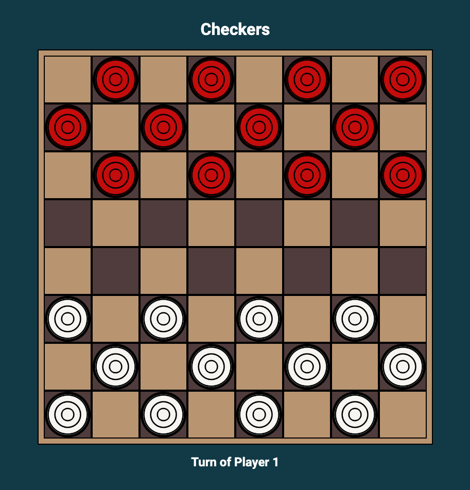
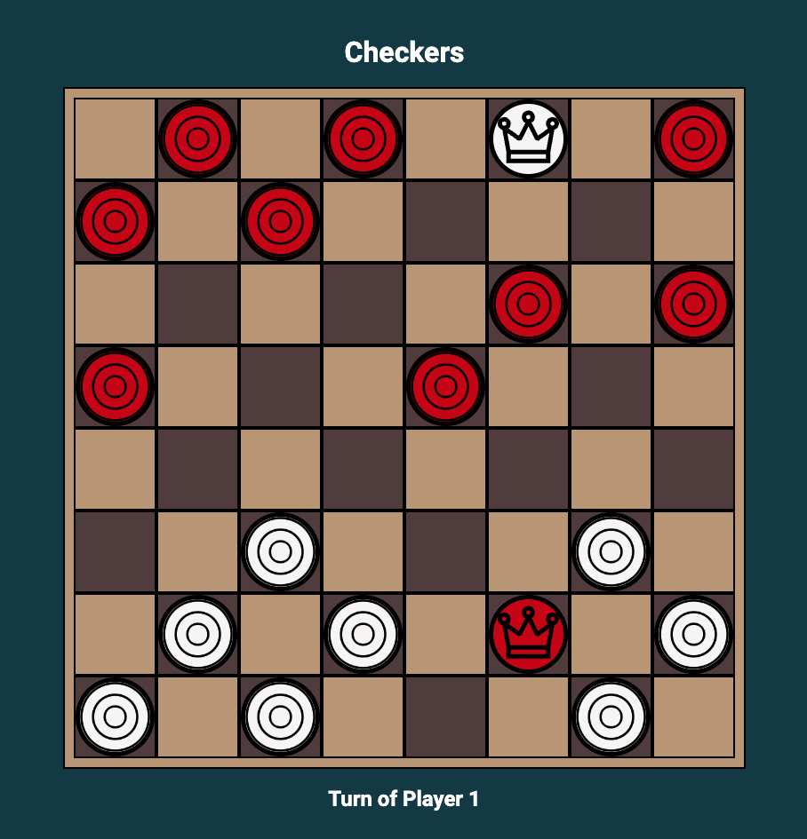

# Checkers

## Descriptions:

This is a two-player checkers game created using vanilla JavaScript, HTML, and CSS. Players will take turns moving their checker pieces by clicking them and then an empty space. The winner will be determined when one player loses all their pieces or is unable to make another move. This project emphasizes functions, object-oriented programming, and DOM manipulation in JavaScript.

## Getting Started:

You can access the game by clicking the link [here](https://debiddo618.github.io/checker-js/).

## Game Images:

## Technologies Used:

- JavaScript
- HTML
- CSS

## Next Steps:

Here are some potential improvements to the project:

- Add AI player
- Flip the board after switching turn
- Implement forced jump functionality
- Compatibility with mobile devices
